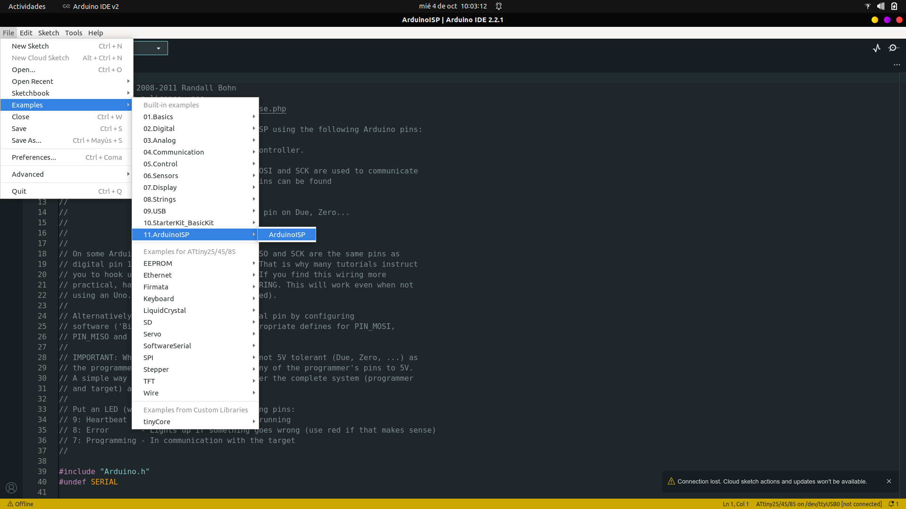
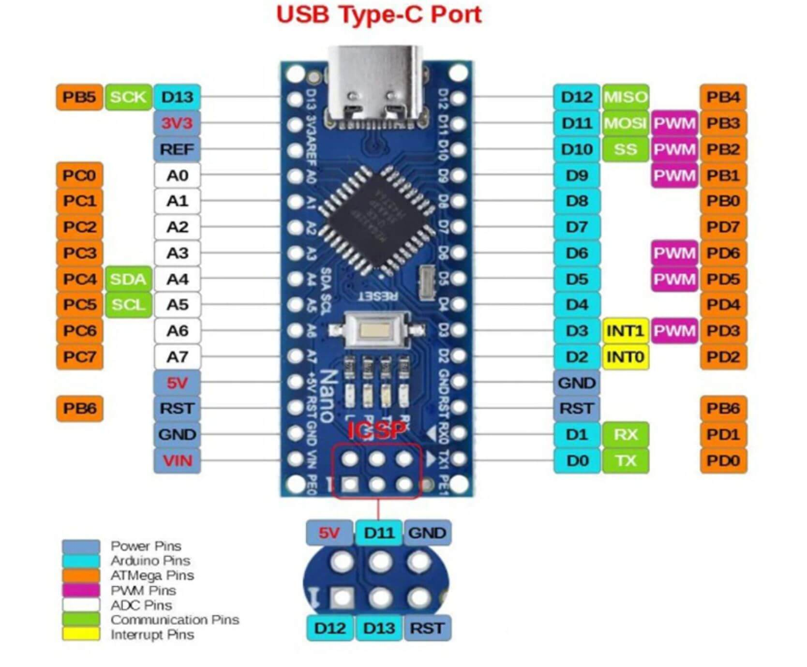
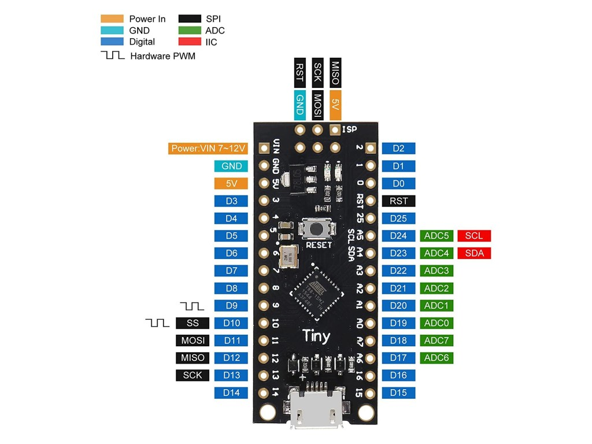
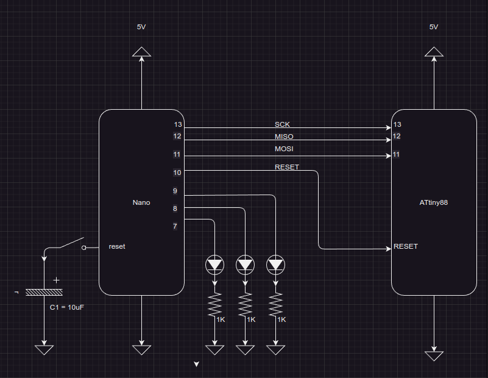
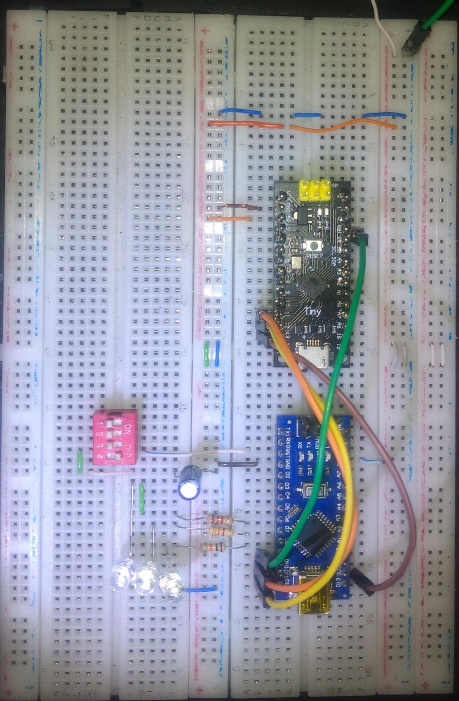
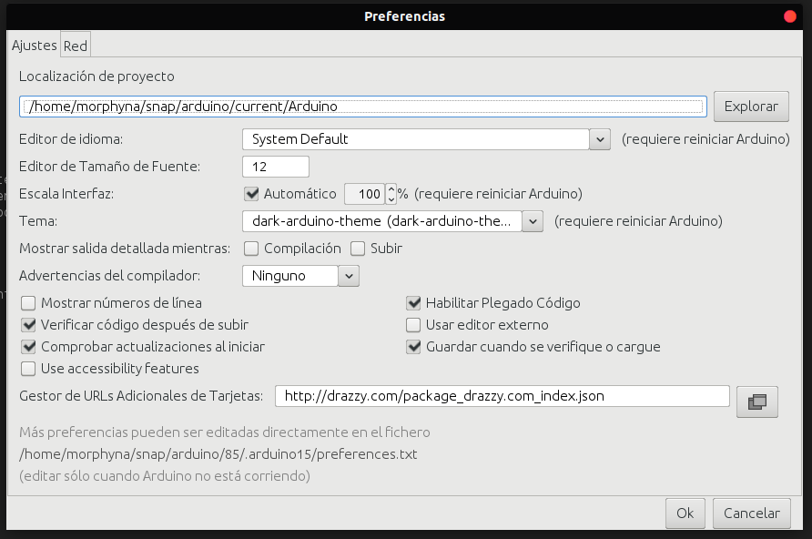
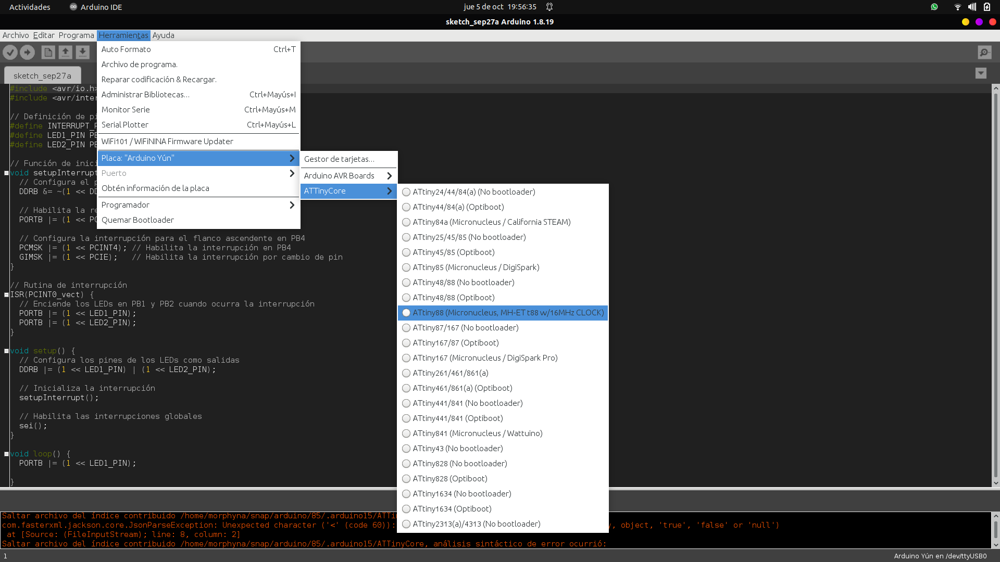
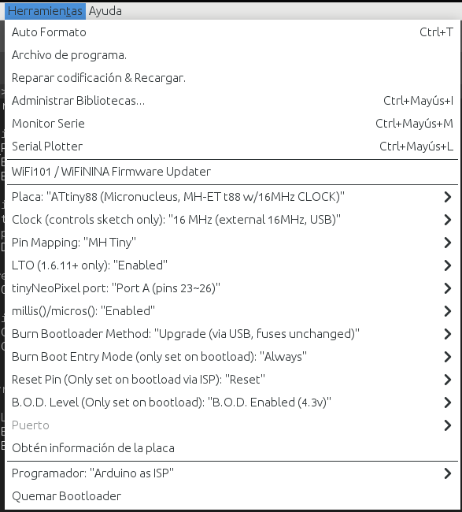
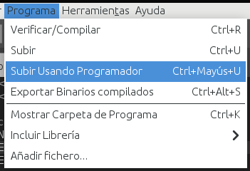

# Guía de Programación de ATtiny88 con Arduino Nano como ISP

## Introducción

La programación de microcontroladores ATtiny88 utilizando Arduino Nano como programador ISP (In-System Programmer) es una tarea útil para proyectos de electrónica y robótica. Este documento proporciona una guía paso a paso para llevar a cabo esta programación.

## Lista de Materiales

Antes de comenzar, asegúrate de tener los siguientes materiales a tu disposición:

- Protoboard
- Cables macho-macho
- Capacitor electrolítico de 10uF
- Arduino Nano
- ATtiny88
- Resistencias
- LEDs

## Preparando Arduino nano

Para que arduino nano te permita cargar tus programas a ATtiny88 debes cargar un sketch que habilite esta funcionalidad.
Para cargar el sketch dirigete a File>Examples>11.ArduinoISP>ArduinoISP

Para cargar el programa siga estos pasos:

- Configurar la placa: Dirijase a Tools>Board>Arduino AVR Boards>Arduino nano.
- Verifique el puerto: Conecte el arduino nano al computador por medio del calble USB y verifique que arduino nano aparece conectado a un puerto, por ejemplo COM3. Si no aparece conectado, seleccione el puerto en Tools>Port>COM##. En el caso que no lepermita seleccionar el puerto puede deberse a 2 factores:
    1. Conexión defectuosa: verifique que el cable este bien conectado y la integridad del cable y los puertos.
    2. Compruebe que los driver de la placa esten instalados, en el caso de nano se requiere el driver para el ch340.

- Cargue el programa pulsando el boton upload (laflecha a la derecha), al finalizar la carga solo debe quedar un led indicador encendido.

### Nota

El programa debe cargarse sin conectar el Capacitor de 10uF entre Reset y GND, si el capacitor esta conectado Arduino IDE podría presentar un error al cargar el sketch.

## Diagramas de Conexión

Para realizar las conexinoes debemos ubicar unos los pines que cumplen la función de comunicación SPI.

- MISO
- MOSI
- SCK
- SS
- RESET
- VCC
- GND

Las siguientes imágenes muestran donde están estos pines en Arduino nano y ATtiny88 respectivamente.

### Conexión del Arduino Nano como ISP

Los pines a usar de Nano serán los siguientes:

- PIN13-------SCK
- PIN12-------MISO
- PIN11-------MOSI
- PIN10-------SS
- PIN9--------LED_HB
- PIN8--------LED_ERR
- PIN7--------LED_PMODE

El pin SS se usara para resetear el ATtiny durante la carga del sketch, además se usarán los pines 9, 8 y 7 para poner indicadores LEDs.

* PIN9 Corresponde al HEARDBEAT (latidos del corazón) muestra atenuación y amplificación en la iluminación para indicar que Arduino nano esta en funcionamiento como ISP.
* PIN8 Se iluminará en caso de error.
* PIN7 Se ilumina en caso de estar activo el PMODE.

### Conexión del ATtiny88

Los pines a usar de ATtiny88:

- PIN13-------SCK
- PIN12-------MISO
- PIN11-------MOSI
- RESET-------RESET

En ATtiny88 solo usaremos 4 pines, básicamente son los mismos que en Nano (si excluimos los indicadores) a excepción del pin de RESET que estará conectado a SS de nano.
Para ver las conexiones de mejor manera observe el siguente diagrama:

## Imágenes del Montaje

El montaje en protoboard integra un dipswitch para facilitar conectar y desconectar el capacitor de 10uF.

## Cargar sketch en ATtiny88

Luego de cargar el programa ArduinoISP en el Arduino Nano y realizar las conexiones indicadas,varias opciones, pero recomiendo usar ATtinyCore, que cuenta con soporte para la gran mayoría de las placas ATtiny.

Dirigete a File>Preference>Additional boards nanager URLs y pega el siguiente URL:

- [Librerías de ATtinyCore](http://drazzy.com/package_drazzy.com_index.json)

Luego dirigete a Tools>Board>Boards manager y escribe 'ATtinyCore'

## Subir el Sketch.

Ya están todos los preparativos, solo falta que escribas tu programa para subirlo, una vez lo tengas dirigete a Tools>Board>ATtinyCore>ATtiny88(Micronucleus...)

Configura el programador como Arduino as ISP

Para cargar el código ve a sketch>Upload Using Programmer

## Recomendaciones

A lo largo del proceso de programación, ten en cuenta las siguientes recomendaciones:

1. Asegúrate de que todas las conexiones estén firmemente establecidas y sin cortocircuitos.
2. Verifica la polaridad correcta del condensador electrolítico (10uF). 
3. Confirma que los pines de programación del ATtiny88 estén conectados según el diagrama.
4. Utiliza una versión de Arduino IDE anterior a la 2.0.

## Enlaces Útiles

Aquí tienes algunos enlaces útiles para continuar con este proyecto:

- [Descargar Arduino IDE](https://www.arduino.cc/en/software)
- [Librerías de ATtinyCore](http://drazzy.com/package_drazzy.com_index.json)
- [Proyecto en GitHub](https://github.com/morphyna/ATtiny.git)

## Conclusiones

En esta guía, has aprendido a programar un microcontrolador ATtiny88 utilizando un Arduino Nano como ISP. Este conocimiento te permitirá realizar proyectos electrónicos y de robótica de manera más versátil. Asegúrate de practicar y experimentar con diferentes programas para maximizar tu comprensión de este proceso.

Recuerda que la programación de microcontroladores es una habilidad valiosa en el campo de la electrónica y la ingeniería, y esta guía es un punto de partida para explorar aún más en este emocionante mundo. ¡Buena suerte en tus proyectos!
